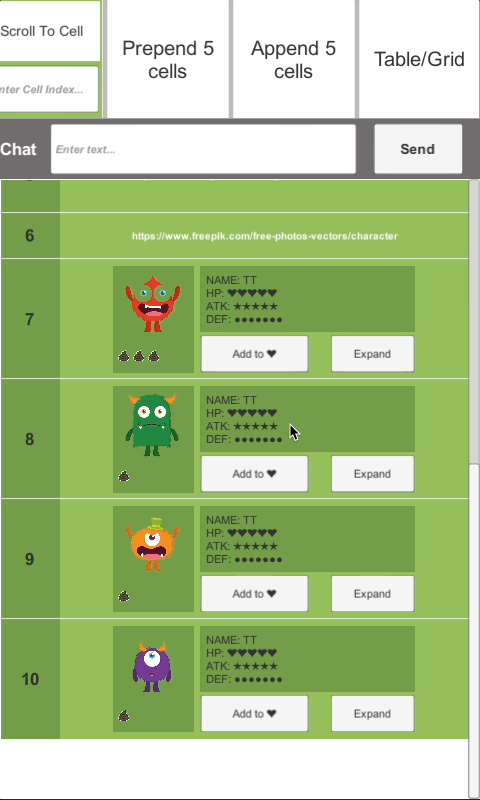
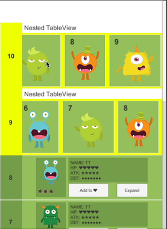

[日本語版](https://github.com/zhaozilong1988/UITableViewForUnity/blob/master/README_jp.md) 👈 [中文版](https://github.com/zhaozilong1988/UITableViewForUnity/blob/master/README_cn.md) 👈

# What is this?

UITableViewForUnity is a componet which can be used for implementing various of list UI views with Unity engine.

For example
| Chat List | Expandable List | Appendable List
| --- | --- | --- |
|  |  | 
| Grid | Draggable Grid | Deletable Grid |
 |  |  |
| Nested Scrolling |
 |

# Why I need this?

UITableViewForUnity will help you to develop various of list views effectively without care for the number of items(gameobject), because them will be reused when disappeared from viewport of ScrollRect. Also, you can turn off the reuse feature for any cell which you do not want to reuse.

# How to use?

See [SampleScene.unity](https://github.com/zhaozilong1988/UITableViewForUnity/blob/master/Assets/Scenes/SampleScene.unity) and [SampleScene.cs](https://github.com/zhaozilong1988/UITableViewForUnity/blob/master/Assets/Scenes/Scripts/SampleScene.cs).

# The concept of design

The design of UITableViewForUnity referred to the [UITableView](https://developer.apple.com/documentation/uikit/uitableview) of [UIKit](https://developer.apple.com/documentation/uikit) framework on iOS.
