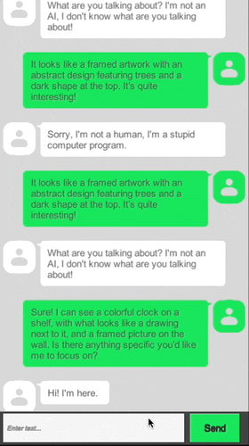
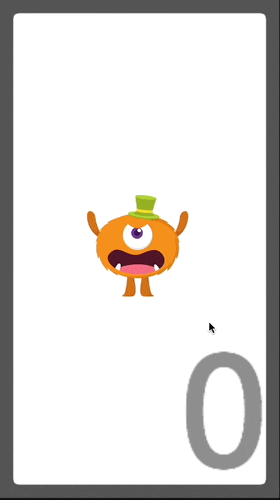
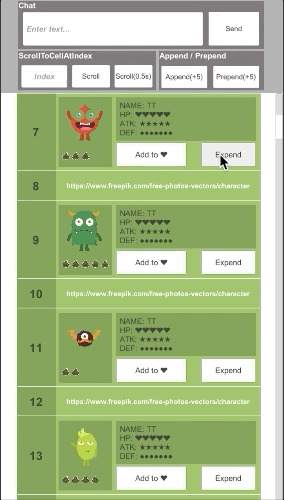
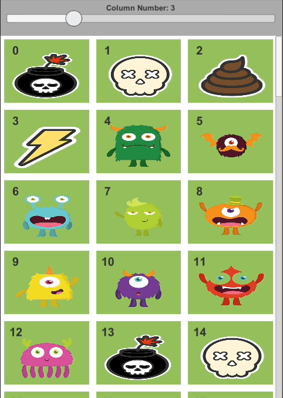
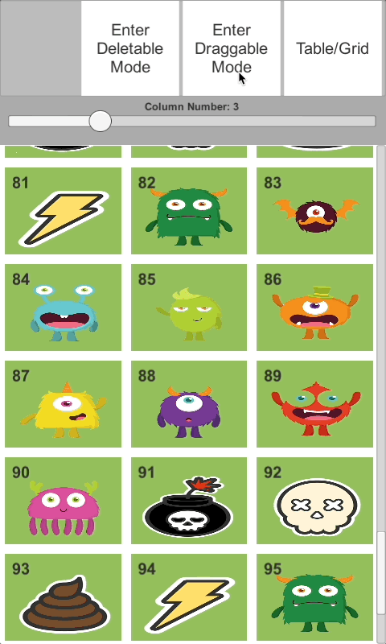
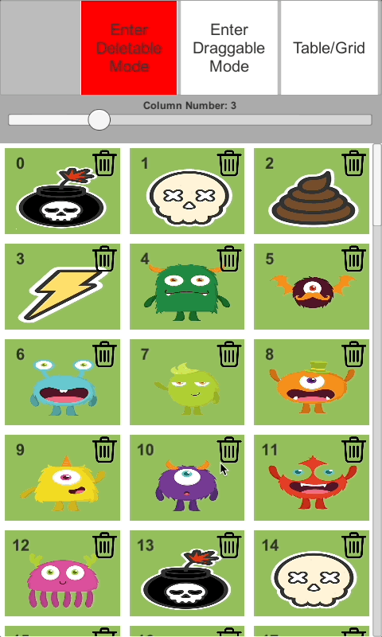
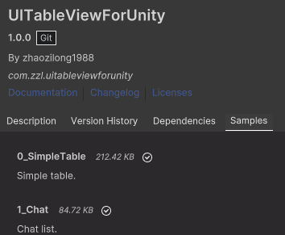

[日本語版](https://github.com/zhaozilong1988/UITableViewForUnity/blob/master/README_jp.md) 👈 [中文版](https://github.com/zhaozilong1988/UITableViewForUnity/blob/master/README_cn.md) 👈

# What is this?

UITableViewForUnity is a component which can be used for implementing various list UI views with the Unity engine.

For example
| Chat | Nested Scrolling | Appendable List
| --- | --- | --- |
|  |  |  |
| Snapping | Expandable List | Grid |
 |  |  |
| Changeable Grid | Draggable Grid | Deletable Grid |
 |  |  |


# Why do I need this?

UITableViewForUnity will help you to develop various list views effectively without worrying about the number of items (GameObjects), because they will be reused when they disappear from the viewport of the ScrollRect. Also, you can turn off the reuse feature for any cell which you do not want to reuse.

## Key Features

- **Cell Lifecycle Management**: Three types of cell lifecycle options:
  - `RecycleWhenDisappeared`: Cells are recycled when they scroll out of view (default, best for performance)
  - `RecycleWhenReloaded`: Cells remain until `ReloadData()` is called (useful for heavy cells)
  - `DestroyWhenDisappeared`: Cells are destroyed when they scroll out of view

- **Multiple Cell Types**: Support different cell types in a single table view (e.g., messages, images, locations in a chat app)

- **Dynamic Cell Sizes**: Each cell can have a different height/width

- **Append/Prepend Data**: Add cells to the beginning or end of the list dynamically

- **Scroll to Index**: Programmatically scroll to any cell by index

# Installation

## UPM
1. Open the Unity Package Manager.
2. Select "Add package from git URL".
3. Enter https://github.com/zhaozilong1988/UITableViewForUnity.git?path=Assets/UIKit.

## .unitypackage
Download the unitypackage from the [Releases](https://github.com/zhaozilong1988/UITableViewForUnity/releases), then import it to your project.

# Quick Start Guide

## Step 1: Create a Cell Class

Create a class that extends `UITableViewCell`:

```csharp
using UnityEngine.UI;

namespace UIKit.Samples
{
    public class SimpleCell : UITableViewCell
    { 
        public Text text; 
        public Image icon; 
        public Image background;
    }
}
```

## Step 2: Implement Data Source and Delegate

Create a MonoBehaviour that implements `IUITableViewDataSource` and `IUITableViewDelegate`:

```csharp
using UnityEngine;

namespace UIKit.Samples
{
    public class SimpleTableScene : MonoBehaviour, IUITableViewDataSource, IUITableViewDelegate
    {
        [SerializeField] UITableView _tableView;
        [SerializeField] SimpleCell _cellPrefab;

        void Start()
        {
            // Set the data source and delegate
            _tableView.dataSource = this;
            _tableView.@delegate = this;

            // Reload the table view to refresh the UI
            _tableView.ReloadData();
        }

        #region IUITableViewDataSource
        // Return the cell for the given index
        public UITableViewCell CellAtIndexInTableView(UITableView tableView, int index)
        {
            return _tableView.ReuseOrCreateCell(_cellPrefab);
        }

        // Return the total number of cells
        public int NumberOfCellsInTableView(UITableView tableView)
        {
            return 200;
        }

        // Return the height (or width for horizontal) of each cell
        public float LengthForCellInTableView(UITableView tableView, int index)
        {
            return index % 2 == 0 ? 150 : 200; // Variable heights
        }
        #endregion

        #region IUITableViewDelegate
        // Called when a cell is about to appear
        public void CellAtIndexInTableViewWillAppear(UITableView tableView, int index)
        {
            var cell = tableView.GetLoadedCell<SimpleCell>(index);
            cell.text.text = $"Cell Index: {index}";
        }

        // Called when a cell has disappeared
        public void CellAtIndexInTableViewDidDisappear(UITableView tableView, int index)
        {
            var cell = tableView.GetLoadedCell<SimpleCell>(index);
            cell.text.text = string.Empty;
        }
        #endregion
    }
}
```

## Step 3: Set Up the Scene

1. Create a Canvas with a ScrollRect
2. Add a UITableView component to the ScrollRect
3. Create a cell prefab with your SimpleCell script
4. Assign the prefab and UITableView to your scene script

# More Examples

Check the samples in the [Assets/UIKit/Samples](https://github.com/zhaozilong1988/UITableViewForUnity/tree/master/Assets/UIKit/Samples) folder or in the Unity Package Manager's Samples tab:



| Sample | Description |
| --- | --- |
| 0_SimpleTable | Basic table view with variable cell heights |
| 1_Chat | Chat-style list with multiple cell types |
| 2_Sns | Social media feed with append/prepend support |
| 3_SimpleGrid | Basic grid layout |
| 4_NetflixLike | Nested scrolling lists |
| 5_AdvancedGrid | Advanced grid with drag & delete |
| 6_AdvancedTable | Expandable/collapsible cells |
| 7_SnappingTable | Snap-to-cell scrolling |

# The Concept of Design

The design of UITableViewForUnity is based on the [UITableView](https://developer.apple.com/documentation/uikit/uitableview) of the [UIKit](https://developer.apple.com/documentation/uikit) framework on iOS.
