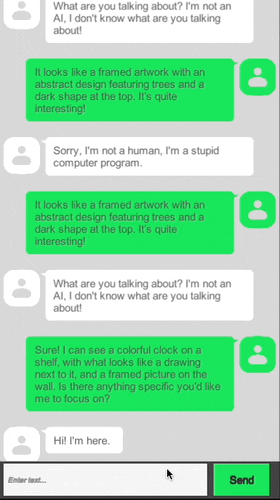
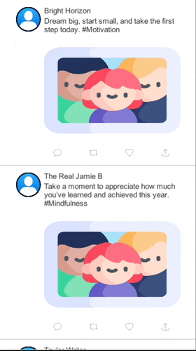
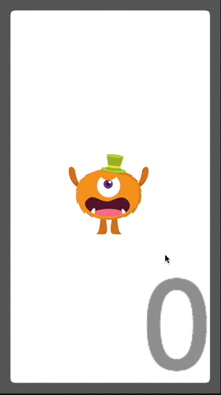
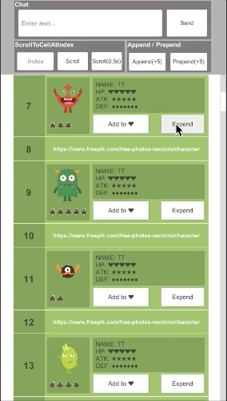
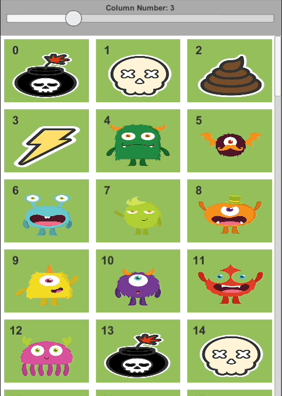
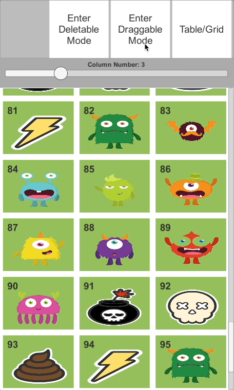
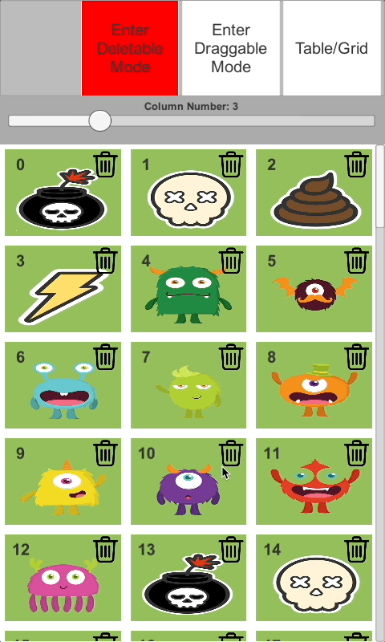
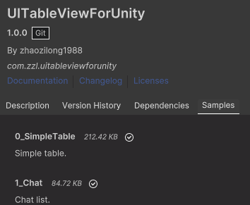

# これは何物？

UITableViewForUnityは、アプリ開発中によくあるリスト系のUI(2D)仕様を、楽に実現できるUnityエンジンのコンポーネントです。

例
| Chat | Nested Scrolling | Appendable List
| --- | --- | --- |
|  |  |  |
| Snapping | Expandable List | Grid |
 |  |  |
| Changeable Grid | Draggable Grid | Deletable Grid |
 |  |  |

# なぜ必要?

アプリの開発でリスト式のUI表示がよく使われています。 

例えば、お知らせリスト、ランキングリスト、チャットリスト、音ゲーなら曲リストなど、Unityエンジンなら、[UnityEngine.UI.ScrollRect](https://docs.unity3d.com/2018.3/Documentation/ScriptReference/UI.ScrollRect.html)(以下ScrollRectで表記)を使うのが多いでしょう。 

ただ、SrollRectはネーミングの通り、スクロールできる以外、リストに入っている一つ一つアイテム(GameObject)のライフサイクルを管理してくれていません。 

特にスマホゲームの場合、端末のスペックもさまざまなので、ライフサイクルが管理されてないと、アイテムは画面外に飛んでいってもDrawCallが増え続くとか、リストが長いほどスクロールが遅くなるとかのパーフォマンス問題が出てきます。 

もちろん、ScrollRectを使いこなして、アイテムの再利用仕組みを容易に作ることができますが、個人経験だと、開発現場で、スケジュールに迫られてしまい、その仕様だけに適用な仕組みしか作れない場合も少なくなく、新しい仕様が出てくると、また仕組みを作り直さなければなりません。 

一つのプロジェクトでそれぞれの画面仕様の要求を満たすため、リストコンポーネントを複数に作られているのも経験したことがあります。 

こういった問題を可能な限り減らしたいと思うので、比較的に汎用なものを作りました。 

特徴は主に以下です。 

① リスト(TableViewと呼ぶ)でアイテム(Cellと呼ぶ)のライフサイクルを管理できる 

Cellのライフサイクルは下記３つのタイプと設計しています。 
- 見えるようになったらロードし、見えなくなるとリサイクル 
- 見えるようになったらロードし、見えなくなってもリサイクルせず、手動リロード時にリサイクル 
- 見えるようになったらロードし、見えなくなると廃棄 

例えば、タイプ１のCellはリサイクル、タイプ２のCellのロードが重いからリサイクルさせたいという選択もできます。 
または、0行目のCellはリサイクル、1行目のCellリサイクルさせないという設定もできます。 
実際違うCellのライフサイクルを別々で管理したいという仕様にあったことはないですが、少数極端のケースで使いたい場合があるかもしれません。 

また、Cellのライフサイクルを管理したくない場合、TableViewでオフにすることもできます。そうすると、全てのCellを一括ロードができます。 

② 違うタイプのCellを一つのTableViewに共存できる 

例えば、チャットTableViewの場合、メッセージ(MessageCell)、スタンプ(StampCell)、位置共有(LocationCell)などレイアウト配置の違うタイプのCellでも一つのTableViewに入れられます。すると、一つGameObjectでいらない物をSetActiveオンしたりオフしたりするという実装が避けられます。

③ 演出の実装ができる 

Cellの高さを自由(0不可)に調整できるので、ジャバラ式みたいな伸縮演出も簡単に実現できます。

④ Cellに対する増減、指定番号(Index)まで移動という操作もできる 

フレンドリストなど、データをページ式で少しずつAPIで取る形なら、TableViewの先頭と後尾からCellをアペンドすることもできます。

# インストール

## UMP
1. Unity Package Manager を開きます。
2. 「Add package from git URL」を選択します。
3. 次の URL を入力します：https://github.com/zhaozilong1988/UITableViewForUnity.git?path=Assets/UIKit.

## .unitypackge
[Releases](https://github.com/zhaozilong1988/UITableViewForUnity/releases)からunitypackageファイルをダウンロードして、プロジェクトにインポートします。

# 使い方

[Assets/UIKit/Samples](https://github.com/zhaozilong1988/UITableViewForUnity/tree/master/Assets/UIKit/Samples)フォルダー内のサンプル、または Unity Package Manager の「Samples」タブをご確認ください。

# 設計について

UITableViewForUnityは、基本iOSの[UIKit](https://developer.apple.com/documentation/uikit)フレームワークの[UITableView](https://developer.apple.com/documentation/uikit/uitableview)の設計を参考して実装していますが、いくつか違うところもあります。

・ | UITableView | UITableViewForUnity
--- | --- | ---
Headerという概念 | あり | ない
Cellのライフサイクル | 回収再利用式のみ | ①見えなくなったら回収 ②リロード時に回収 ③見えなくなったら廃棄 の3種類がある
ScrollViewとの関係 | UIScrollViewを継承 | ScrollRectとは別で独立
